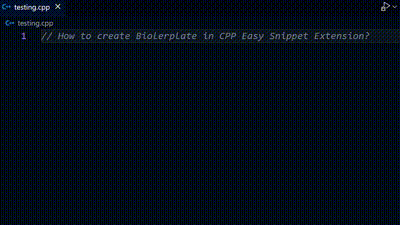

# Lazy Coder

## Description

Boost your C++ development productivity with the CPP Boilerplate Generator extension for Visual Studio Code. Say goodbye to repetitive code setup and hello to streamlined project initialization. This extension provides essential C++ boilerplate code snippets and templates, helping you kickstart your projects swiftly and efficiently.

## How to use

**Step 1:** Install CPP Easy Snippet<br>
**Step 2:** Not Download Yet? [Download Now](https://marketplace.visualstudio.com/items?itemName=MahfujulSagor.lazycoder)<br>
**Step 3:** Find all snippets below and use as per need.<br>
**Step 4:** Happy Coding<br>

## Watch Tutorial



## All C++ Code Snippets

## 📜 Snippets without namespace `std`

| No  | CPP Snippet Without std | Header Files Include        |
| :-- | :--------------------- | :-------------------------- |
| 1   | io                     | iostream                    |
| 2   | cpphello               | iostream, helloworld        |
| 3   | ioal                   | iostream, algorithm         |
| 4   | iovec                  | iostream, vector            |
| 5   | iostr                  | iostream, string            |
| 6   | ioset                  | iostream, set               |
| 7   | iomap                  | iostream, map               |
| 8   | iopair                 | iostream, utility           |
| 9   | iostack                | iostream, stack             |
| 10  | ioque                  | iostream, queue             |
| 11  | iodeque                | iostream, deque             |
| 12  | iopq                   | iostream, queue             |
| 13  | iolist                 | iostream, list              |
| 14  | ioit                   | iostream, iterator          |
| 15  | ioalvec                | iostream, algorithm, vector |
| 16  | iostackvec             | iostream, stack, vector     |

---

## 📜 Snippets with namespace `std`

| No  | CPP Snippet With std | Header Files Include        |
| :-- | :--------------------- | :-------------------------- |
| 1   | io                     | iostream                    |
| 2   | cpphello               | iostream, helloworld        |
| 3   | ioal                   | iostream, algorithm         |
| 4   | iovec                  | iostream, vector            |
| 5   | iostr                  | iostream, string            |
| 6   | ioset                  | iostream, set               |
| 7   | iomap                  | iostream, map               |
| 8   | iopair                 | iostream, utility           |
| 9   | iostack                | iostream, stack             |
| 10  | ioque                  | iostream, queue             |
| 11  | iodeque                | iostream, deque             |
| 12  | iopq                   | iostream, queue             |
| 13  | iolist                 | iostream, list              |
| 14  | ioit                   | iostream, iterator          |
| 15  | ioalvec                | iostream, algorithm, vector |
| 16  | iostackvec             | iostream, stack, vector     |

---

## 📜 Library Inclusion

| Prefix | Expands To |
|--------|--------------------------------|
| `!io`   | `#include <iostream>`        |
| `!al`   | `#include <algorithm>`       |
| `!vec`  | `#include <vector>`          |
| `!str`  | `#include <string>`          |
| `!set`  | `#include <set>`             |
| `!map`  | `#include <map>`             |
| `!pair` | `#include <utility>`         |
| `!stack` | `#include <stack>`          |
| `!queue` | `#include <queue>`          |
| `!deque` | `#include <deque>`          |
| `!pq` | `#include <queue>`             |
| `!list` | `#include <list>`            |
| `!it` | `#include <iterator>`         |
| `!all` | `#include <bits/stdc++.h>`    |

---

## 📜 Code Snippets

### With namespace `std`

| Prefix    | Expands To                     |
|-----------|---------------------------------|
| `in`      | `cin >> $1;`                    |
| `out`     | `cout << $1 << endl;`           |
| `ing`     | `getline(cin, $1);`             |
| `stding`  | `std::getline(cin, $1);`        |
| `stdout`  | `std::cout << $1 << std::endl;` |
| `stdin`   | `std::cin >> $1;`               |
| `vdec`    | `std::vector<$1> $2;`           |
| `vdecsize`| `std::vector<$1> $2($3);`       |
| `vint`    | `std::vector<int> $1;`          |
| `vstr`    | `std::vector<string> $1;`       |
| `vchar`   | `std::vector<char> $1;`         |
| `vdouble` | `std::vector<double> $1;`       |
| `vfloat`  | `std::vector<float> $1;`        |
| `vbool`   | `std::vector<bool> $1;`         |
| `vll`     | `std::vector<long long> $1;`    |
| `stdvdec` | `std::vector<$1> $2;`           |
| `stdvdecsize`| `std::vector<$1> $2($3);`    |
| `stdvint` | `std::vector<int> $1;`          |
| `stdvstr` | `std::vector<string> $1;`       |
| `stdvchar`| `std::vector<char> $1;`         |
| `stdvdouble`| `std::vector<double> $1;`     |
| `stdvfloat`| `std::vector<float> $1;`       |
| `stdvbool`| `std::vector<bool> $1;`         |
| `stdvll`  | `std::vector<long long> $1;`    |

### Without namespace `std`

| Prefix    | Expands To                     |
|-----------|---------------------------------|
| `vdec`    | `#include <vector>` `vector<$1> $2;`           |
| `vdecsize`| `#include <vector>` `vector<$1> $2($3);`       |
| `vint`    | `#include <vector>` `vector<int> $1;`          |
| `vstr`    | `#include <vector>` `vector<string> $1;`       |
| `vchar`   | `#include <vector>` `vector<char> $1;`         |
| `vdouble` | `#include <vector>` `vector<double> $1;`       |
| `vfloat`  | `#include <vector>` `vector<float> $1;`        |
| `vbool`   | `#include <vector>` `vector<bool> $1;`         |
| `vll`     | `#include <vector>` `vector<long long> $1;`    |
| `stdvdec` | `#include <vector>` `std::vector<$1> $2;`           |
| `stdvdecsize`| `#include <vector>` `std::vector<$1> $2($3);`    |
| `stdvint` | `#include <vector>` `std::vector<int> $1;`          |
| `stdvstr` | `#include <vector>` `std::vector<string> $1;`       |
| `stdvchar`| `#include <vector>` `std::vector<char> $1;`         |
| `stdvdouble`| `#include <vector>` `std::vector<double> $1;`     |
| `stdvfloat`| `#include <vector>` `std::vector<float> $1;`       |
| `stdvbool`| `#include <vector>` `std::vector<bool> $1;`         |
| `stdvll`  | `#include <vector>` `std::vector<long long> $1;`    |

---

### View Snippet Codes

**1. io = iostream**

```cpp
#include <iostream>
using namespace std;
int main()
{
    return 0;
}
```

**2. cpphello = iostream + hello**

```cpp
#include <iostream>
using namespace std;
int main()
{
    cout << "Hello World!" << endl;
    return 0;
}
```

**3. ioal = iostream + algorithm**

```cpp
#include <iostream>
#include <algorithm>
using namespace std;

int main()
{
    return 0;
}
```

**4. iovec = iostream + vector**

```cpp
#include <iostream>
#include <vector>
using namespace std;
int main()
{
    return 0;
}
```

**5. iostr = iostream + string**

```cpp
#include <iostream>
#include <string>
using namespace std;
int main()
{
    return 0;
}
```

**6. ioset = iostream + set**

```cpp
#include <iostream>
#include <set>
using namespace std;
int main()
{
    return 0;
}
```

**7. iomap = iostream + map**

```cpp
#include<iostream>
#include <map>
using namespace std;
int main()
{
    return 0;
}
```

**8. iopair = iostream + utility**

```cpp
#include<iostream>
#include <utility>
using namespace std;
int main()
{
    return 0;
}
```

**9. iostack = iostream + stack**

```cpp
#include <iostream>
#include <stack>
using namespace std;
int main()
{
    return 0;
}
```

**10. ioque = iostream + queue**

```cpp
#include<iostream>
#include <queue>
using namespace std;
int main()
{
    return 0;
}
```

**11. iodeque = iostream + deque**

```cpp
#include<iostream>
#include <deque>
using namespace std;
int main()
{
    return 0;
}
```

**12. iopq = iostream + queue**

```cpp
#include<iostream>
#include <queue>
using namespace std;
int main()
{
    return 0;
}
```

**13. iolist = iostream + list**

```cpp
#include<iostream>
#include <list>
using namespace std;
int main()
{
    return 0;
}
```

**14. ioit = iostream + iterator**

```cpp
#include<iostream>
#include <iterator>
using namespace std;
int main()
{
    return 0;
}
```

**15. ioalvec = iostream + algorithm + vector**

```cpp
#include<iostream>
#include <algorithm>
#include <vector>
using namespace std;
int main()
{
    return 0;
}
```

**16. iostackvec = iostream + stack + vector**

```cpp
#include <iostream>
#include <stack>
#include <vector>
using namespace std;
int main()
{
    return 0;
}
```

**Enjoy!**
